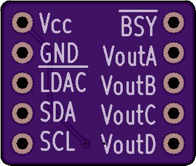

# MCP4728-Breakout

A breakout board for the Microchip i2c 4-channel DAC

------------------------

### What is in this repository:

**./doc**:  Location for documentation

**./KiCAD**:  Hardware design files

**./Arduino**:  Arduino driver

------------------------

Front | Back
:-------:|:------:
  | 
